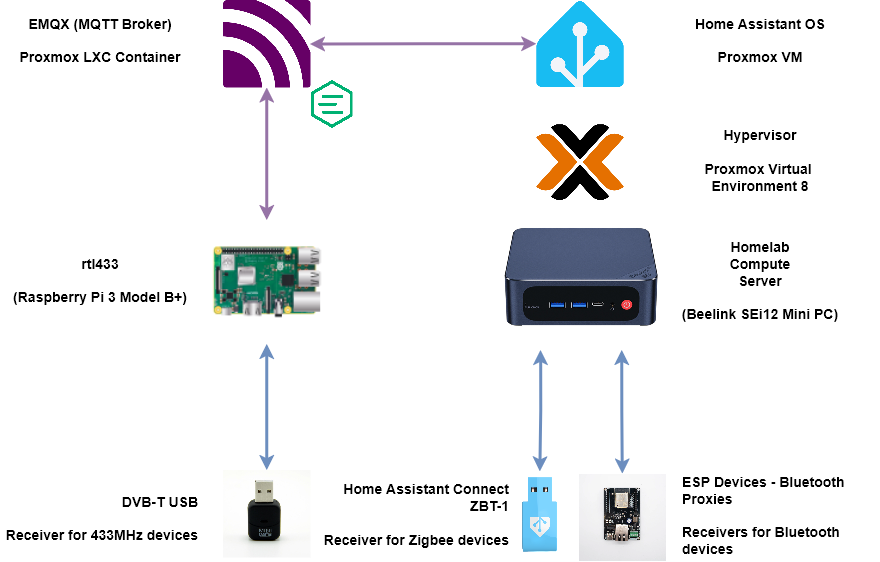
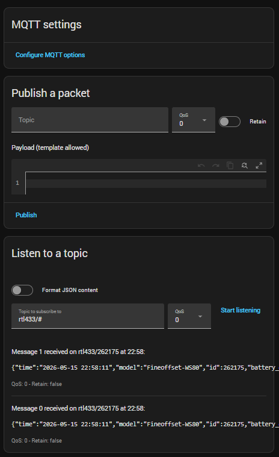

# homeassistant-rtl433-integration

Scripts and instructions to integrate serial data feeds via rtl_433 to Home Assistant

# Purpose

Integrating data from RF serial devices, such as weather stations, into Home Assistant.

## Requirements

### Hardware

DVB-T receiver connected to a Linux based host - a Raspberry Pi is a good solution, that is on the same network as the Home Assistant host.

An example set up is shown below.



### Software

#### rtl_433

The [rtl_433 project][rtl_433] is a data receiver able to decode many RF serial devices and has direct support to push the data to an MQTT Broker.

[rtl_433]: https://github.com/merbanan/rtl_433

#### MQTT Broker

[MQTT](https://mqtt.org) is utilised as the messaging protocol between rtl_433 and Home Assistant.

The easiest way to run a broker with Home Assistant is to utilise the Mosquitto Broker app for Home Assistant following the [MQTT integration instructions][ha-mqtt].

[ha-mqtt]: https://www.home-assistant.io/integrations/mqtt

## Setting up rtl_433

### Installation

On a Raspberry Pi, assumed to be running Raspberry Pi OS and with internet access, clone the rtl_433 Github repository using

```bash
git clone https://github.com/merbanan/rtl_433.git
```

Follow the instructions in the [rtl_433/docs/BUILDING.md][rtl_433_building] to build and install the rtl_433 binary, summarised as

```bash
sudo apt install build-essential cmake
cd rtl_433/
cmake -B build
sudo cmake --build build --target install
```

[rtl_433_building]: https://github.com/merbanan/rtl_433/blob/master/docs/BUILDING.md

Install the rtl-sdr rules using

```bash
git clone https://github.com/osmocom/rtl-sdr
sudo cp ./rtl-sdr/rtl-sdr.rules /etc/udev/rules.d/20-rtl-sdr.rules
sudo reboot
```

### Testing

Test data is being captured by running

```bash
rtl_test
```

### Running

Edit the script to [`run_rtl433.sh`](./run_rtl433.sh) to define the address of the MQTT_BROKER. If using the Home Assistant Mosquitto app, the address will be the hostname
of the Home Assistant host.

Run the script using the following to put the rtl_433 process into the background.

```bash
nohup ./run_rtl433.sh &
```

To run the script again, stop the existing running instance of rtl_433 use `ps -aef | grep rtl_433` to get the process ID (PID) and then run `kill <PID>`.

The sript will need to be run again if the Raspberry Pi is rebooted.

TODO: Create a service defnintion to automatically run the script.

## Setting up Home Assistant

Add MQTT integration.

From the intregation on the settings and within the `Listen to a topic` section, enter `rtl433/#`. Should see messages as they are being published via rtl_433,
as shown in the follwing image.


